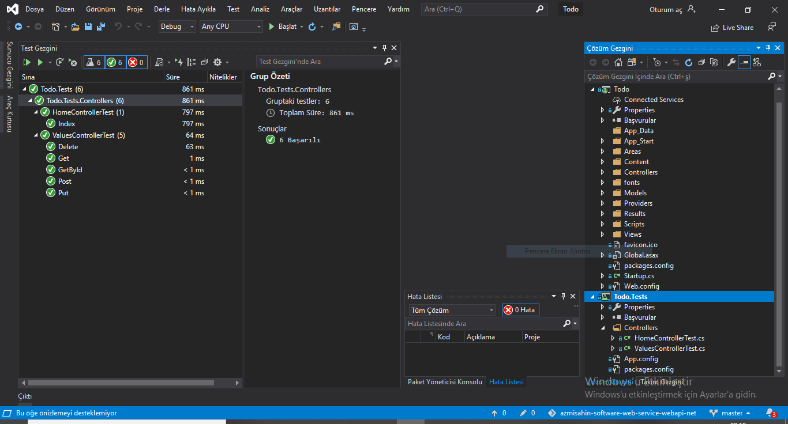
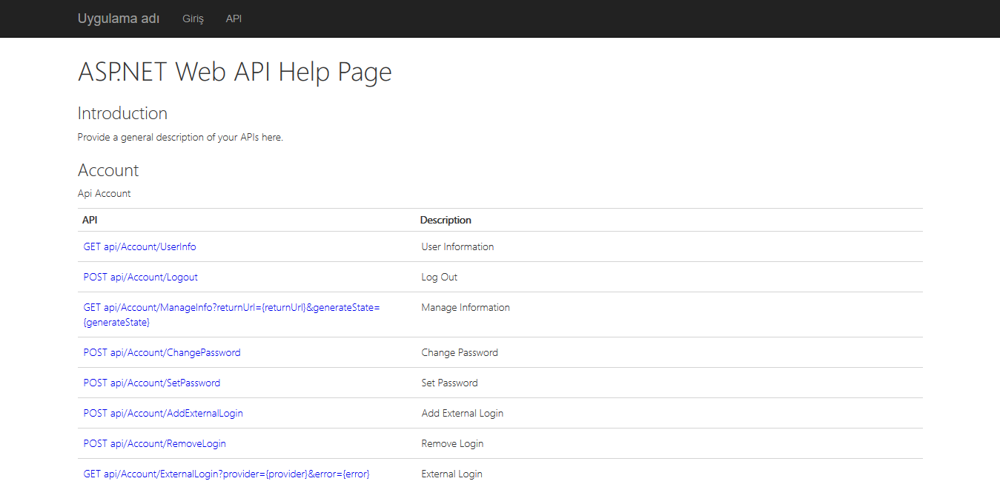
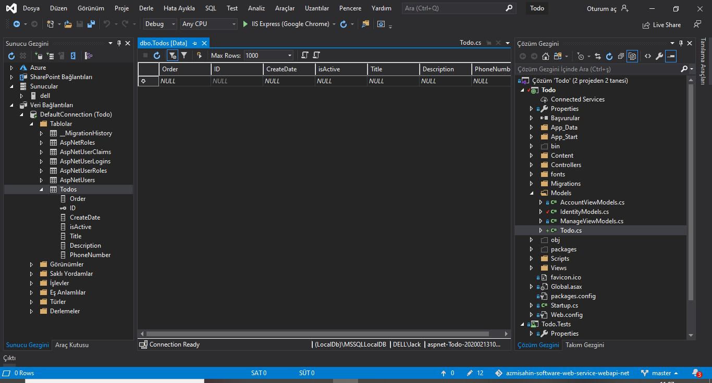
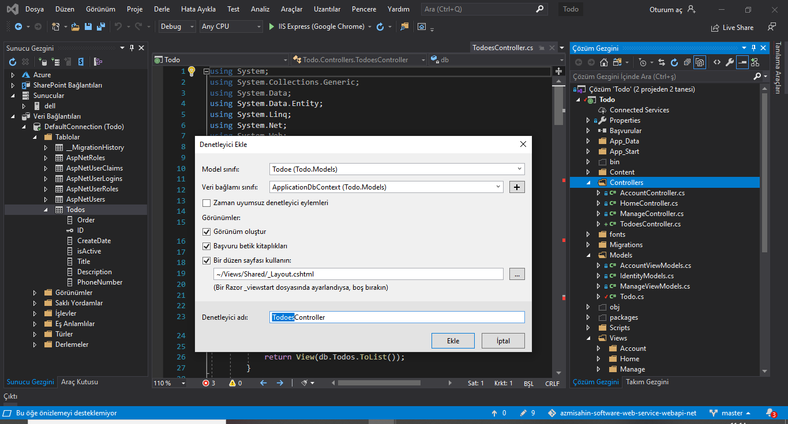
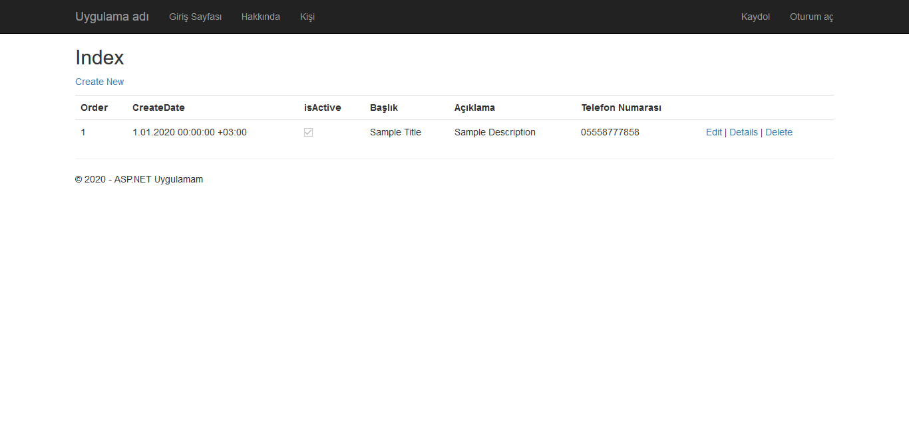

# 

# Web Api with .netframework

It uses the ASP.NET Web API to create an API that returns a list of web products.

# Test Project


[Document Web Site](https://azmisahin.github.io/azmisahin-software-web-service-webapi-net/)



# Password Policy
IdentityConfig.cs
```
manager.PasswordValidator = new PasswordValidator
{
    RequiredLength = 6,
    RequireNonLetterOrDigit = false,
    RequireDigit = false,
    RequireLowercase = false,
    RequireUppercase = false,
};
```
# Add Todo Table
```
namespace Todo.Models
{
    /// <summary>
    /// Todo
    /// </summary>
    [Table("Todos")]
    public class Todoe
    {
        /// <summary>
        /// 
        /// </summary>
        [Key]
        [DatabaseGenerated(DatabaseGeneratedOption.Identity)]
        public int ID { get; set; }

        /// <summary>
        /// Order
        /// </summary>
        [DefaultValue(0)]
        [Column(Order = 0)]
        public int Order { get; set; }

        /// <summary>
        /// Create Date
        /// </summary>
        public DateTimeOffset? CreateDate { get; set; }

        /// <summary>
        /// Is Active
        /// </summary>
        [DefaultValue(true)]
        public bool isActive { get; set; }

        /// <summary>
        /// Title
        /// </summary>
        [Required]
        [Display(Name = "Baþlýk")]
        [StringLength(50, ErrorMessage = "{0}, en az {2} karakter uzunluðunda olmalýdýr.", MinimumLength = 6)]
        public string Title { get; set; }

        /// <summary>
        /// Description
        /// </summary>
        [Required]
        [Display(Name = "Açýklama")]
        [StringLength(100, ErrorMessage = "{0}, en az {2} karakter uzunluðunda olmalýdýr.", MinimumLength = 6)]
        public string Description { get; set; }

        /// <summary>
        /// Phone Number
        /// </summary>
        [Required]
        [Phone]
        [Display(Name = "Telefon Numarasý")]
        public string PhoneNumber { get; set; }

        /// <summary>
        /// Todo
        /// </summary>
        public Todoe()
        {
            CreateDate = DateTime.Now;
        }
    }
```

# IdentityModels
```
 public class ApplicationDbContex{
         .
         .
         .

        /// <summary>
        /// Todos
        /// </summary>
        public virtual DbSet<Todoe> Todos { get; set; }

        .
        .
        .
```
# Enable Migration
Enable-Migrations: Enables the migration in your project by creating a Configuration class.
Add-Migration: Creates a new migration class as per specified name with the Up() and Down() methods.
Update-Database: Executes the last migration file created by the Add-Migration command and applies changes to the database schema.

Package Manager Console
```
Enable-Migrations 
Add-Migration Todos
Update-Database
```



# Entity Freamework Controller
```
namespace Todo.Controllers
{
    /// <summary>
    /// Todo
    /// </summary>
    public class TodoesController : Controller
    {
        private ApplicationDbContext db = new ApplicationDbContext();

        /// <summary>
        /// Page
        /// </summary>
        /// <returns></returns>
        public ActionResult Index()
        {
            return View(db.Todos.ToList());
        }

        /// <summary>
        /// Details
        /// </summary>
        /// <param name="id"></param>
        /// <returns></returns>
        public ActionResult Details(int? id)
        {
            if (id == null)
            {
                return new HttpStatusCodeResult(HttpStatusCode.BadRequest);
            }
            Todoe todo = db.Todos.Find(id);
            if (todo == null)
            {
                return HttpNotFound();
            }
            return View(todo);
        }

        /// <summary>
        /// Create
        /// </summary>
        /// <returns></returns>
        public ActionResult Create()
        {
            return View();
        }

        /// <summary>
        ///  POST: Todoes/Create
        /// Aþýrý gönderim saldýrýlarýndan korunmak için, lütfen baðlamak istediðiniz belirli özellikleri etkinleþtirin,
        /// daha fazla bilgi için https://go.microsoft.com/fwlink/?LinkId=317598 sayfasýna bakýn.
        /// </summary>
        /// <param name="todo"></param>
        /// <returns></returns>
        [HttpPost]
        [ValidateAntiForgeryToken]
        public ActionResult Create([Bind(Include = "ID,Order,CreateDate,isActive,Title,Description,PhoneNumber")] Todoe todo)
        {
            if (ModelState.IsValid)
            {
                db.Todos.Add(todo);
                db.SaveChanges();
                return RedirectToAction("Index");
            }

            return View(todo);
        }

        /// <summary>
        /// Edit
        /// </summary>
        /// <param name="id"></param>
        /// <returns></returns>
        public ActionResult Edit(int? id)
        {
            if (id == null)
            {
                return new HttpStatusCodeResult(HttpStatusCode.BadRequest);
            }
            Todoe todo = db.Todos.Find(id);
            if (todo == null)
            {
                return HttpNotFound();
            }
            return View(todo);
        }


        /// <summary>
        /// POST: Todoes/Edit/5
        /// Aþýrý gönderim saldýrýlarýndan korunmak için, lütfen baðlamak istediðiniz belirli özellikleri etkinleþtirin,
        /// daha fazla bilgi için https://go.microsoft.com/fwlink/?LinkId=317598 sayfasýna bakýn.
        /// </summary>
        /// <param name="todo"></param>
        /// <returns></returns>
        [HttpPost]
        [ValidateAntiForgeryToken]
        public ActionResult Edit([Bind(Include = "ID,Order,CreateDate,isActive,Title,Description,PhoneNumber")] Todoe todo)
        {
            if (ModelState.IsValid)
            {
                db.Entry(todo).State = EntityState.Modified;
                db.SaveChanges();
                return RedirectToAction("Index");
            }
            return View(todo);
        }

        /// <summary>
        /// Delete
        /// </summary>
        /// <param name="id"></param>
        /// <returns></returns>
        public ActionResult Delete(int? id)
        {
            if (id == null)
            {
                return new HttpStatusCodeResult(HttpStatusCode.BadRequest);
            }
            Todoe todo = db.Todos.Find(id);
            if (todo == null)
            {
                return HttpNotFound();
            }
            return View(todo);
        }

        /// <summary>
        /// Delete
        /// </summary>
        /// <param name="id"></param>
        /// <returns></returns>
        [HttpPost, ActionName("Delete")]
        [ValidateAntiForgeryToken]
        public ActionResult DeleteConfirmed(int id)
        {
            Todoe todo = db.Todos.Find(id);
            db.Todos.Remove(todo);
            db.SaveChanges();
            return RedirectToAction("Index");
        }

        /// <summary>
        /// Dispose
        /// </summary>
        /// <param name="disposing"></param>
        protected override void Dispose(bool disposing)
        {
            if (disposing)
            {
                db.Dispose();
            }
            base.Dispose(disposing);
        }
    }
}
```


# Identity IsAuthenticated Navigation Menu
_LoginPartial.cshtml
```
@if (Request.IsAuthenticated){
.
.
<li>
    @Html.ActionLink("Todoes", "Index", "Todoes", routeValues: null, htmlAttributes: new { title = "Todo" })
</li>
.
.
}
```
/Todoes Page
# 